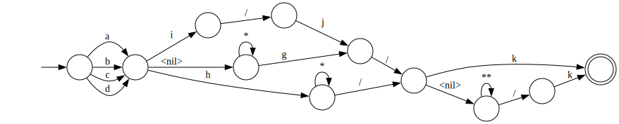

# zzglob

[](https://pkg.go.dev/github.com/DrJosh9000/zzglob)

A better glob for Go?

## Goals

* <abbr title="Done">✅</abbr> Glob in a deterministic order, like `fs.WalkDir`.
* <abbr title="Done">✅</abbr> Support the classics like `?` and `*`, and also
  modern conveniences like `**`, `{x,y,z}`, and `[abc]`.
* <abbr title="Done">✅</abbr> Optionally traverse directory symlinks.
* <abbr title="Done">✅</abbr> Avoid walking directories unnecessarily -
  globbing `foo*/bar` should only walk inside directories starting with `foo`,
  not other directories.
* <abbr title="Done">✅</abbr> Pass walk errors (e.g. permissions errors) to the
  callback.

Also the implementation shouldn't be totally inscruitable. It is based on a
state machine, and I have attempted to cleanly separate each parsing phase.
You can convert a pattern to GraphViz format, that you can then convert into a
diagram, by calling `Pattern.WriteDot`. `zzglob` includes a tool called `zzdot`
which can do this for you, e.g.:

```shell
go run cmd/zzdot/zzdot.go '[abcd]{*g,h*,i/j}/**/k' | dot -Tsvg > example.svg
```



## In progress

* <abbr title="WIP">⌚️</abbr> Improving the tests.
* <abbr title="Thinking about">🧠</abbr> Support globbing over any `io.FS`, not
  just the host filesystem.
* <abbr title="Thinking about">🧠</abbr> Add support for
  [even more syntax](https://www.digitalocean.com/community/tools/glob)

## Pattern syntax

* `\` - used to escape the next character in the pattern. `\x` matches `x`, `\*`
  matches `*`.
* `/` - the path separator. Separates segments of each path.
  Matches itself only.
* `?` - matches exactly one character, except for `/`.
* `*` - matches zero or more characters, except for `/`.
* `**` - matches zero or more characters, including `/`. Since it can be used
  to mean zero or more path components, `/**/` also matches `/`.
* `{a,b,c}` - matches `a` or `b` or `c`. A component can be empty, e.g. `{,a,b}`
  matches either nothing or `a` or `b`. Multiple path segments, `*`, `**`, etc
  are all allowed within `{}`. To specify a path containing `,` within `{}`,
  escape it (`\,`).
* `[abc]` - matches a single character (`a` or `b` or `c`). `[]` is a shorter
  way to write a match for a single character than `{}`.
